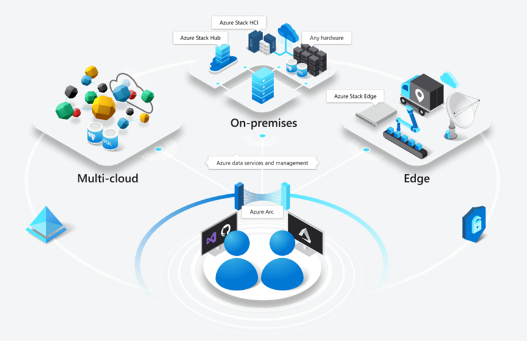

# Azure-Arc
Azure Arc 101
## Introduction
This is an introduction to play with Azure Arc :

## **Disclaimer**

**The features described in this workshop might be not yet production-ready, we enable preview-features for the purpose of learning.**

See also :

- [https://docs.microsoft.com/en-us/azure/azure-arc/kubernetes/overview](https://docs.microsoft.com/en-us/azure/azure-arc/kubernetes/overview)
- [https://azure.microsoft.com/en-us/resources/videos/kubernetes-app-management-with-azure-arc](https://azure.microsoft.com/en-us/resources/videos/kubernetes-app-management-with-azure-arc)
- [https://aka.ms/AzureArcK8sDemoGuides](https://aka.ms/AzureArcK8sDemoGuides)
- [https://github.com/Azure/azure-arc-kubernetes-examples](https://github.com/Azure/azure-arc-kubernetes-examples)
- [https://github.com/Azure/arc-helm-demo](https://github.com/Azure/arc-helm-demo)
- [https://github.com/Azure/arc-k8s-demo](https://github.com/Azure/arc-k8s-demo)

- [https://github.com/microsoft/azure_arc](https://github.com/microsoft/azure_arc)
- [https://azurearcjumpstart.io](https://azurearcjumpstart.io)
- [Install a single node Cluster on Windows 10](https://download.microsoft.com/download/b/8/e/b8ecef54-3612-4883-a73c-6b9f6dd63a61/Install-a-single-node-cluster-of-Kubernetes-on-Windows-10.pdf)
- [//Build video Azure Arc and Kubernetes: a Developer Story](https://mybuild.microsoft.com/sessions/42d3ed24-6773-45c8-82bd-6dec4a583c89)
-  : in French / en Français ! 

## ToC

1. Setup [Tools](tools.md)
1. Check [subscription](subscription.md)
1. Setup [environment variables](set-var.md)
1. Setup [pre-requisites](setup-prereq.md)
1. Setup [HELM](setup-helm.md)
1. Setup [K3S cluster](setup-k3s.md)
1. Setup [AKS cluster](setup-aks.md)
1. Setup [ARO cluster](setup-aro.md)
1. Setup [GKE cluster](setup-gke.md)
1. Setup [EKS cluster](setup-eks.md)
1. Setup [Azure Arc for Server](setup-arc-servers.md)
1. Setup [Azure Arc for Data](setup-arc-data.md)